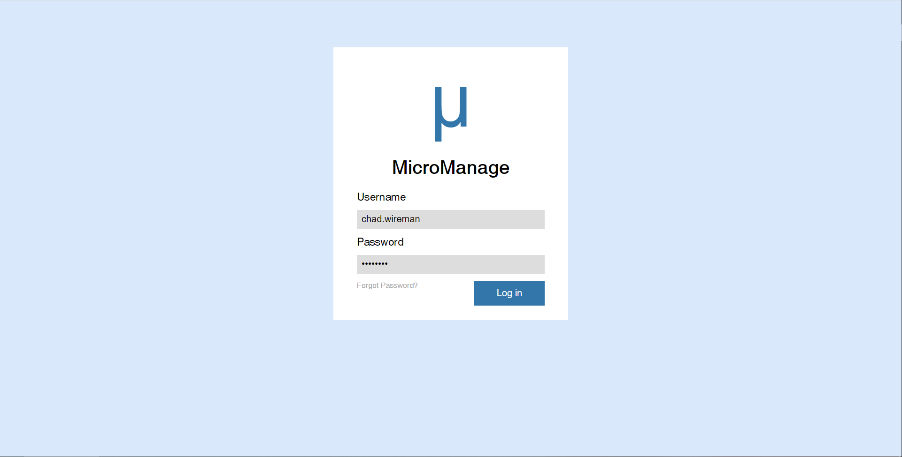

# Project-Code-Components
All the code for our project

<h2>Application: Micro Manage &mu; </h2>
  Our applications is a web based Calender that will hold user events and appointments.    
  
  &mu; will notify users to upcoming appointments and color code events to urgency and importance.  
  We will have a task prediction feature, that given a specific task and how much time it will require to complete, &mu; will 
  split it into even portions before the due date and place in open spots in the users calender.  
  Users will be able to view their schedules by day, week, or month.
  
  
  
  
<h3> Design and Architecture:</h3>
  <bold>Tools that are used:</bold>
  <ul>
  <li>HTML/CSS</li>
  <li>JavaScript</li>
  <li>React Framework</li>
  <li>Node.js</li>
  <li>Postgres SQL</li>
  <li>WordPress (Possibly)</li>
  </ul>
  
  <h3> Postgres Database     </h3>
  <h2>Users Table</h2>
<table>
	<tr>
		<th>Columns</th>
		<th>Column Values/Description</th>
	</tr>
	<tr>
		<td>user_name</td>
		<td>varchar | Name of the user </td>
	</tr>
	<tr>
		<td>user_password</td>
		<td>varchar | stores user password for entry and authentication</td>
	</tr>
	<tr>
		<td>user_email</td>
		<td>varchar | stores user email for reminders and two factor authentication</td>
	</tr>
	<tr>
		<td>if</td>
		<td>serial | each user has unique id</td>
	</tr>
</table>

 

<h2>Appointments Table</h2>
<table>
	<tr>
		<th>Columns</th>
		<th>Column Values/Description</th>
	</tr>
	<tr>
		<td>name_of_event</td>
		<td>varchar | Name of event</td>
	</tr>
	<tr>
		<td>start_time</td>
		<td>timestamp without timezone | Date of the event</td>
	</tr>
	<tr>
		<td>length_of_event</td>
		<td>interval | Length of the event </td>
	</tr>
	<tr>
		<td>end_time</td>
		<td>timestamp without timezone | end date of the event </td>
	</tr>
	<tr>
		<td>urgency_of_event</td>
		<td>integer | Integer value that determines how important the event is, 0-100 with 100 being of the utmost importance</td>
	</tr>
	<tr>
		<td>color_of_event</td>
		<td>varchar | Stores values in a "#xxxxx" format so users can customize their calender</td>
	</tr>
	<tr>
		<td>id_of_event</td>
		<td>serial | unique id for each appointment</td>
	</tr>
	<tr>
		<td>user_id</td>
		<td>integer | Stores the unique id from users table</td>
	</tr>
	
</table>

  
  
  
  For our calender main page we are using Js and the React framework to create a simple and intuitive UI.
  Our login page is basic HTML and CSS.
  For connecting our Postgres database with the webpage we will be using Node.js, which will also be used to query the database.
  

<h3>Accomplished so far:</h3>
-[X] Login page  
-[X]Postgres DB Basic Layout 
-[X]Basic layout of calender  

<h3>What we are working on next:</h3>

  <ul>
  <li>Making the website a Progressive web application, allowing users to update their calender without internet accesss, and having those updates transfer to the database the next time they log onto the internet. </li>
  <li>Having Two-factor authentication for added security</li>
  <li>Text and/or email notifications</li>
  <li>Making Postgres db able to ssh into from anywhere</li>
  </ul>
  
  
  <h3>Individual Task Assignments</h3>
		<strong>Front End</strong> 
		<bold>Brooke</bold> 
		 <bold>Chad</bold>  
		<strong>Back End</strong> 
		 <bold>Ian</bold> 
		 <bold>Chris</bold>  
		<strong>Integration</strong> 
		 <bold>Jacob</bold> 
  		 <bold>Rahul</bold>   

